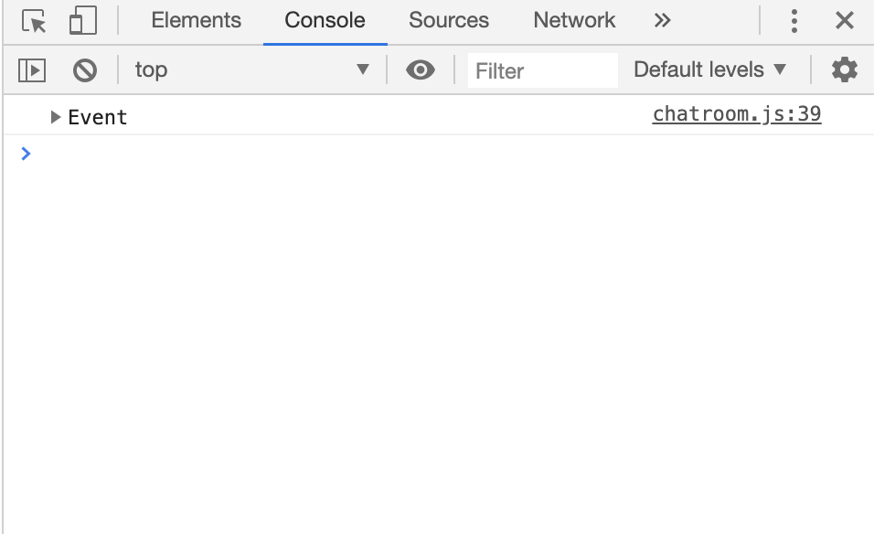

# Websocket-Lab
Welcome to the Websocket-Lab. The purpose of this lab is to introduce yourself to the AWS Websocket on Amazon API Gateway,
released on December 18, 2018. (To read more about the release please visit
<a href="https://aws.amazon.com/blogs/compute/announcing-websocket-apis-in-amazon-api-gateway/" target="blank">here.</a> 
<details>
<summary> Please refer below for a short description of the services used in this lab: </summary>
<br>

* **IAM Roles and Policies**: AWS offers users the AWS Identity and Access Management (IAM) service to users as a way to enhance security among the products that they use.
The IAM roles and policies are used in this lab to help limit the amount of access some of our products can have to other products.
To read more please visit:
<a href="https://aws.amazon.com/iam/"target="_blank">here</a>.

* **AWS Lambda**: The cornerstone product in AWS offerings of server-less products. This product is the backbone of our computing and business logic for our application. Lambda functions, are triggered by an event and when invoked execute a block of code. In this lab
Lambda is used as a receiver for when we send messages to our Websocket, and then handle those messages accordingly. 
To read more please visit: 
<a href="https://aws.amazon.com/lambda/" target="_blank">here</a>.
* **Amazon DynamoDB**: AWS' trademark NoSQL database. DynamoDB is used in this lab to keep track of session information as users interact with 
the Chat room.
To read more please visit: 
<a href="https://aws.amazon.com/dynamodb/" target="_blank">here</a>.
* **Amazon APIGateway**: APIGateway is used in this lab as the supplier of a websocket for our application. The APIGatway websocket configuration is setup as routes. Routes are pathways for messages to travel. For example if there is a route called "message" when
a message is sent to the APIGatway that containts the action as "message" that route will be taken. It is important to note that 
APIGateway websocket has three defualt routes: $connect, $disconnect, and $default. These routes are triggered when a socket is opened, closed, and have no other matching routes respectively.
To read more please visit: 
<a href="https://aws.amazon.com/api-gateway/" target="_blank">here</a>.
* On *the programming side*: We are using raw unadultarated javascript and html for the browser and User Interface. And for the lambda function we are using node.js version 10.

</details>

## Pre-Requisites
In order to complete this lab you are required to have access to the following:
* IAM
* DynamoDB
* Lambda
* API Gateway 

# Basic Lab

## Context
In this lab we are going to create 3 microservices. These microservices manage and operate a functional chat room.

* There is the **client-records** table stored in DynamoDB. This stores the connection info for all of the users.
* There are a few lambda functions. Each have their own respective action.
    * **Connect**: this function is used to store the connection ID in DynamoDB
    * **Send Message**: This function is used to send messages to everyone in the chat room.
    * **Disconnect** This function cleans up any session data that was related to the user that disconnected.

There are three lambda Funtions for this lab to show that once orientated with the WebSocket API and the microservice pattern, you can then easily deploy new services with ease.

Before we begin with tasks, it is recommended that you clone the GitHub Repo to your local machine located 
<a href="https://github.com/cjhillbrand/websocket-sandbox" target="_blank">here</a>.

## Task 1: Creating DynamoDB Tables

1. Visit the 
<a href="https://console.aws.amazon.com/dynamodb/" target="_blank">DynamoDB console</a>
2. Click on the **Create Table** button.
3. At this stage:
    1. Enter **"client-records"** for table name.
    2. Enter **"ID"** for the primary key.
    3. Press **create**
4. This is going to start spinning up our table.

Wait until the table is created and that the table name and primary keys are correct. *Make sure to note **casing** for primary key*

## Task 2: Creating the Lambda functions
Each Lambda function has it's own source code, and accesses different services, which directly affects the roles and permissions assigned to it. Refer to the table below for configurations.

| Function Name | Location of Source                                                                         | Location of Role                                                                                  | Services Accessed  |
|---------------|--------------------------------------------------------------------------------------------|------------------|--------------------|
| Connect       | <a href="resources/aws-utils/ConnectionLambda/index.js" target="_blank">Link to Source</a> | <a href="resources/aws-utils/ConnectionLambda/role.js" target="_blank">Role Link </a>   | DynamoDB           |
| SendMessage   | <a href="resources/aws-utils/DispatchLambda/index.js" target="_blank">Link to Source</a>   | <a href="resources/aws-utils/DispatchLambda/index.js" target="_blank">Link to Role</a>  | DynamoDB WebSocket |
| Disconnect    | <a href="resources/aws-utils/DisconnectLambda/" target="_blank">Link to Source</a> | <a href="resources/aws-utils/DispatchLambda/role.js" target="_blank">Link to Role</a>             | DynamoDB           |

### Step 1: Creating the Lambda Functions and inputting code. 

1. Navigate to the 
<a href="https://console.aws.amazon.com/lambda/home" target="_blank">Lambda Dashboard</a>

2. For each Lambda Function above:
    1. Click on the button **create a function** If the button is not visible, check on the console for a menu on the left, with the label *functions*, and then hit on the ***Create Function*** button.
    2. Select **Author From Scratch** 
    3. Under the section **Basic Information**:
        1. For Function name put the function name listed in the table above.
        2. For **Runtime**, select the latest supported version for Node.js
        3. For **Permissions**, we need to give the lambda function the required permissions we have listed above.
            * Click on **Choose or create an execution role**. This unfolds a section where we can trigger the creation of the role for our lambda function.
            * For execution Role, select **Create new role from AWS policy templates**. This will expand two fields below the section: 
                * For the **Role Name** input the *function-name* + Role, so for example the **Connect** function's role would be **ConnectRole**. 
                * Do not select anything for the **Policy template** field.
    4. Click the **Create Function** button on the bottom of the right hand side of the page. You should now be taken to the dashboard of that lambda function.
    5. Scroll down to where you see the function code. It looks like a code editor and should have one open tab with the file *index.js* 
    6. Copy and paste the code for each function (located in the table above) into the editor. Click **Save** in the top right corner when finished.
        * Take some time and read over the code for each function. They either perform some action to DynamoDB or send a message via the websocket. Moving forward this fundamental understanding of the code helps understand how our chatroom deals with the information given to it. 
        
        *Note: The code for each function is made to handle this lab and the extended lab. There is a comment in each .js file that says **This is the beginning of the code for the extended lab.** Feel free to continue reading but is only neccessary for the extended lab.*

### Step 2: Adjusting Permissions
*Note: For Lambda functions that need permissions to our WebSocket, we need to first receive the ARN for our WebSocket before attaching the permission. With this in mind the one function that needs this permission requires us to complete this step after we have created the Websocket* 
1. Scroll down on the page of your lambda function and find the section *Execution Role* 
2. Check to see if there is a link to the role that you created previously. Open that link in another tab of your browser.
3. We are now at the IAM Access and Policy page for our Role. If we have done everything correctly thus far regarding the permissions there should be none under the *Permission Policies* Table. 
4. Click on the **+ Add inline policy** button located to the right and midway down the page. 
5. Click on the **JSON** Tab. This is where we can add in our custom permissions to our role.
6. Paste the policy (role.json) in each respective functions folder to the editor.
7. Replace the \<ARN> with the ARN for the designated resource. 
8. For the name put, **Custom-Inline-Policy** (since these are inline policies and only in the scope of each respective role there will not be any *naming* overlap)

## Task 3: Creating the WebSocket on API Gateway

### Step 1: Create WebSocket
1. Navigate to the API Gateway console 
<a href="https://console.aws.amazon.com/apigateway/home" target="_blank">here</a>.
2. Depending on the state of your account you can find a **Create API** or **Get Started** Button. Click on the one that you see and you are going to be take a create API page.
    1. Press the **WebSocket** radio button for **Choose the Protocol**.
    2. For **API name** put, **chatroom-websocket**
    3. For **Route Selection Expression** enter `$request.body.action` 
       *Note: If you want to learn more about routes and what they do click on the **Learn More** button next to the input box*
    4. For Description enter, **WebSocket for a Chatroom web page**.
    5. Click **Create API**

### Step 2: Creating a role for API Gateway
1. Go to the IAM dashboard 
<a href="https://console.aws.amazon.com/iam/home" target="_blank">here</a>
2. Click on **Roles** 
3. Click on **Create Role** 
4. Choose **API Gateway** as the resource and then scroll to the bottom and press next.
5. Click on **Next: Tags** and then **Next: Review**
6. For role name enter, **WebSocketAPIRole**, then click **Create**
7. Confirm the Role was made by clicking on it.
8. Now we need to add an line policy so our WebSocket can invoke lambda functions
    1. Go to the repository and find the directory websocket-sandbox/resources/APIGateway
    2. Copy the file **role.json**
    3. Go back to the **IAM** webpage
    4. Click on **+ Add inline policy** 
    5. Click **JSON** and then paste into the editor.
    6. Click **review changes**
    7. For the name put **Custom-Inline-Policy** and then press **Save changes**
8. Copy the **Role ARN** or keep this info handy. We will be using it very shortly.

### Step 3: Add a Messaging Route
1. Head back to the Dashboard of your WebSocket
1. If you are not already, navigate to the **routes** page.
2. In the box **New Route Key** enter, **dispatch**, and click the checkmark to the right of the box.

### Step 4: Configuring the Target Backend
While still on the page thats titled *Provide information about the target backend that this route will call and whether the incoming payload should be modified.* Do the following:
1. Make sure that the **Lambda Function** radio is pressed and **Use Lambda Proxy Integration** is pressed.
2. For Lambda function enter **SendMessage**. This field should suggest a lambda function you have already made.
3. Enter in the **API Gateway ARN Role** we made two steps ago.  
4. Cick **Use Default Timeout** 
5. Press **Save** and click **Ok** for any pop-ups.
6. Repeat these steps for the $connect and $disconnect, but with their respective lambda functions.

### Step 5: Deploying the WebSocket
1. Click on the **Actions** dropdown, and select **Deploy API**
2. For the **Deployment Stage** enter click on **[New Stage]**
    1. For **Stage Name** enter, **development**
    2. You can leave the descriptions blank, or enter what you like.
    3. Press **Deploy**
3. Keep track of the **WebSocket URL** this is used in our local code.

*Note: When adjusting permissions for the lambda we couldn't start adjusting for two of them until this step has been completed. Please go back to **Adjusting Permissions** for **Task 2**. The best way to copy the ARNs is to have an **IAM**, **API Gateway** and **DynamoDB** tab open so you can switch between the two copying and pasting ARNs.*

## Task 4: Creating the GUI for the Chatroom
*Note: This task is completed using a **Google Chrome Browser**, but feel free to use what you are comfortable with*
### Step 1: Configure Websocket on the UI
1. On your local machine navigate to: websocket-sandbox/chatroom/aws-utils.js
2. Under the **AWS_CONFIG** for the key **websocket** enter the Websocket URL we grabbed in the last task.

### Step 2: Test UI Functionality
1. On a browser on your local machine open websocket-sandbox/chatroom/index.html
2. Open the console on your browser. *Note: There are different ways to do this, but for Google Chrome and Firefox just right click and then press **inspect** then navigate to the console pane* 
3. The console should look like this:



if everything up to this point has worked there should be one event logged in our console.

4. The moment we have been waiting for, sending and receiving messages.
    1. Since this is the basic chatroom, we did not introduce the ability for custom names, or the creation of joining chatrooms. If you are interested in doing this take a look at the **Extended Lab** which walks through how to do this. To make sure that our UI knows we are in a *Simple Mode*:
        * enter **no-rooms** in the **Please Enter a Name** text box.
        * Click **Register**
        * The **Submit** button under the message text box should now be enabled.
    If not refresh the page, enter **no-rooms** and try again.
    2. Enter any message in the text box labeled **Type a Message here**
    3. Press **Submit** under the text box.
    4. There may be a delay before the message shows up, but eventually we should receive the message we just sent.
    5. Take a look at the **Message Event** in the console. It can be of value to look at the payload here and look at the code in the **SendMessage** lambda and see where our message traveled and how it got transformed. Look ecspecially at this snippet of code in the **SendMessage** Lambda:
    ```javascript
    for (let connectionId of connectionData) {
        try {
            await apigwManagementApi.postToConnection({ ConnectionId: connectionId, Data: message}).promise();
        } catch (e) {
            if (e.statusCode == 410) {
                await db.delete({TableName: "client-records", Key: { ID: connectionId }}).promise();
            }
        }
    }
    ```
    *Note: the `e.statusCode == 410` what does the code 410 mean? I recommend looking at the documentation and doing a deeper dive and do some investigating!*

5. If this lab is being completed in conjunction with other individuals and you want to try and send messages to eachother all you have to do is change the awsconfig.js. Change it to:
```javascript
const AWS_CONFIG = {
    "region": "us-east-1",
    "websocket": "<websocket of your partner>",
    "name": "Websocket-Lab",
}
```
now everyone should have the same websocket URL. 
**Congratulations you are done with this lab! Have fun and send messages to eachother!**

# Extended Lab
The purpose of this extended portion is:
1. introduce more functionality into our chatroom.
2. Demonstrate the ease at which you can build more microservice on top of the WebSocket.

*Note: This lab must be done once the first lab is done*

## Task 1: Create **ANOTHER** DynamoDB Table
Follow the steps in the Simple lab for Task 1 and create another DynamoDB Table, but change the following:
1. Table Name: **room-messages-users**
2. Primary Key: **room**

## Task 2: Deploying **MORE** Lambda functions.
| Function Name | Location of Source                                                                       | Location of Role |Permissions        | Route      |
|---------------|------------------------------------------------------------------------------------------|------------------|--------------------|------------| 
| RegisterUser  | <a href="resources/aws-utils/RegisterUserLambda/index.js" target="_blank">Source Link</a>| <a href="resources/aws-utils/RegisterUserLambda/role.js" target="_blank">Role Link</a> | DynamoDB           | register   |
| CreateRoom    | <a href="resources/aws-utils/CreateRoomLambda/index.js" target="_blank">Source Link</a>  | <a href="resources/aws-utils/CreateRoomLambda/role.js" target="_blank">Role Link</a>   | DynamoDB WebSocket | new-room   |
| JoinRoom      | <a href="resources/aws-utils/JoinRoomLambda/index.js" target="_blank">Source Link</a>    | <a href="resources/aws-utils/JoinRoomLambda/role.js" target="_blank">Role Link</a>     | DynamoDB WebSocket | join-room  |
| LeaveRoom     | <a href="resources/aws-utils/LeaveRoomLambda/index.js" target="_blank">Source Link</a>   | <a href="resources/aws-utils/LeaveRoomLambda/role.js" target="_blank">Role Link</a>    | DynamoDB WebSocket | leave-room |

### Step 1: Create the new Lambda Functions
For this task we are going to follow the same instructions as Task 2 in the Simple Lab, except just be sure to use the correct names, source code, and role.json when configuring. (Which is located under the directory listed above.)

### Step 2: Update our old Lambda Functions' Permissions
We also need to go back and edit some of our permissions to some of our lmabda functions. The two that we need to go back and edit are **Disconnect** and **SendMessage**.
1. Go to the lambda dashboard.
2. Select the lambda function you want to alter.
3. Scroll down to **Execution Role** and press the link to the role name.
4. Click on the role with the policy type **inline policy** This should have a drop down menu appear:
5. Click **Edit Policy**
6. Click **JSON**
7. Input updated permissions:
    1. On your local machine, find the correct directory for the function you are working with, labeled above.
    2. Copy the **role-extended.json** and paste into the editor
    
    *Note: For Dispatch you are only adding one more resource, which is the newly created DynamoDB table. Copying and pasting may not be the quickest way to update this, instead I suggest changing the resource to be:*
    ```javascript
    "Resource": [
        "*"
    ]
    ```
    *But this does give access to all DynamoDB Tables.*
8. Click **Review Policyy**
9. Finally Click **Save Changes**

*Note: You must re-enter the custom ARNs into the new policies for newly made functions and revised policies. This **WILL** cause issues if this isnt configured properly.*

## Task 3: Adding **MORE** Routes to our WebSocket
1. Navigate to the API Gateway Dashboard and click on your websocket, **chatroom-websocket**. 
2. Click on the **routes** tab on the sidebar. Do the following for each new route:
    3. Create a new route with the **route name** in the table above 
    4. When you're done creating the route make sure to click the **Add Integration Response** to each one.
        This allows us to return a JSON object from our function back to the local client.
3. When you have created 4 new routes and configured their lambda response correctly, click on **Actions** 
4. Finally click **Deploy API**
    1. For stage name, choose **Development** 
    2. For description choose whatever you like.
5. Click **Deploy**


That's it! Now your chatroom has full functional chatrooms and user names!

# Cleaning Up
1. Delete all Lambda functions in the Lambda dashboards 
2. Delete all roles associated with the lambda functions **AND** the role attached to API Gateway
3. Delete the WebSocket from API Gateway
4. Delete all tables from DynamoDB.

# Looking to the Future

**Q.** How can we federate who accesses the websocket? 

**A.** Using a combination of Cognito and IAM Permissions/Groups we can federate who can access the websocket URL and we can actually give different access to different users! If we wanted one person to have access to send a message and another group not to, this can all be done with Cognito and IAM. Read more about Cognito 
<a href="https://aws.amazon.com/cognito/" target="_blank">here</a>.

**Q.** I understand that I accessed my chatroom file on my local machine, but I want anyone on the internet to access it, how can I do this?

**A.** There are definitely plenty of ways! In the spirit of the lab there is a serverless approach that uses several different services:
* Route 53: This is AWS' DNS resolver, and also domain registrar.
* CloudFront: This is AWS' CDN, utilizing edge capabilities we can deliver our chatroom to users accross different regions and still give them a reliable performance (or even better...?).
* S3: Place all of our static content here! This is a cheap, easy, and secure way to store our files. S3 also has website hosting capabilities.


